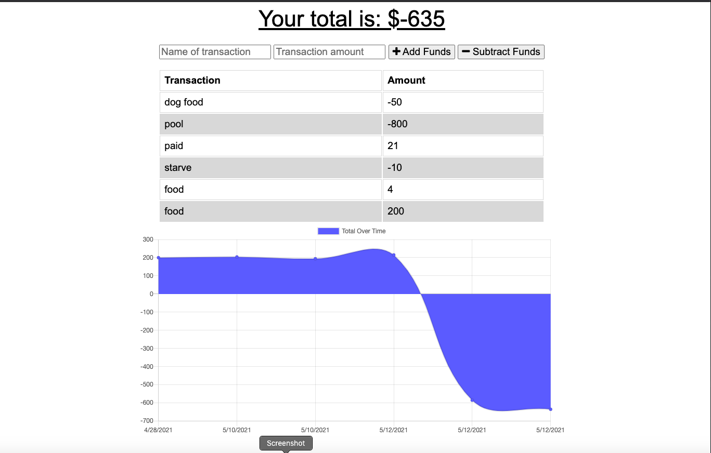

# Budget-Tracker
[](https://opensource.org/licenses/MIT)

## Description
With this users are able to post and update online or when offline. To help better keep a more accurate budget.




## Table of Contents
* [Installation](#installation)
* [Usage](#usage)
* [Contribute](#contribute)
* [Tests](#tests)
* [Questions](#questions)
## Installion
For this project be sure to run the following command in your terminal to install the necessary dependencies.
```
npm i
```

## Usage
install depencies and run the code or go to the deployed site.
## License
MIT## Contribute
email bfitzpatrick28@gmail.com
## Tests
```
npm test
```

## Questions
If you have any questions at all please reach out to [fitzpatb](https://github.com/fitzpatb/Budget-Tracker) or email directly at bfitzpatrick28@gmail.com